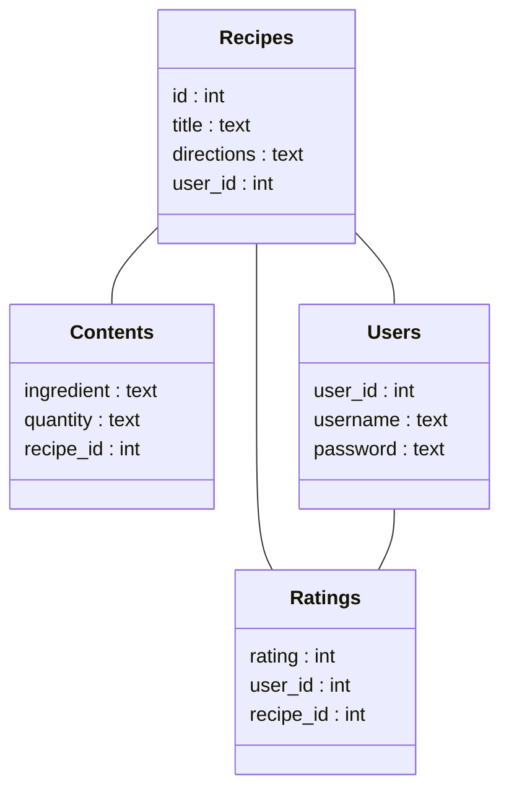

```mermaid
classDiagram
    class Recipes{
        id : int
        title : text
        directions : text
        user_id : int
    } 
    class Contents{
        ingredient : text
        quantity : text
        recipe_id : int
    }
    class Ratings{
        rating : int
        user_id : int
        recipe_id : int
    }
    class Users{
        user_id : int
        username : text
        password : text
    }
    Recipes -- Users
    Recipes -- Contents
    Recipes -- Ratings
    Users -- Ratings
```
